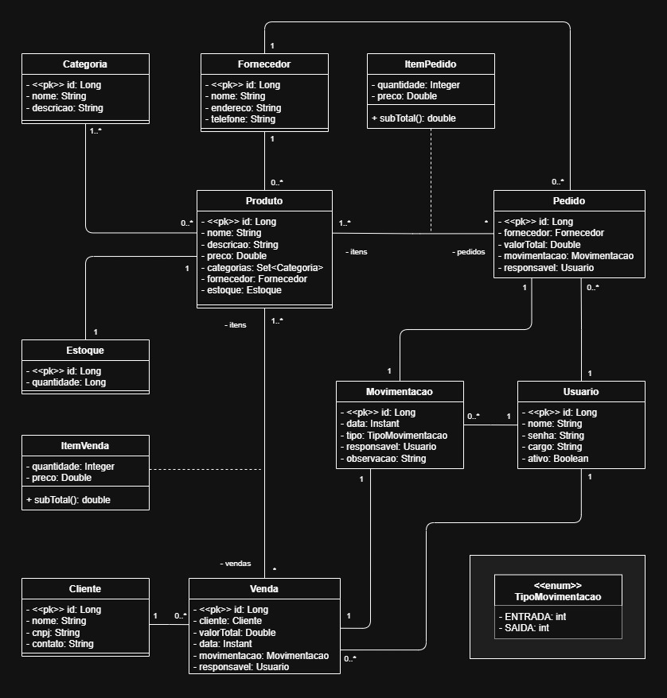

# Projeto de Sistema de Gerenciamento de Estoque - Arquitetura Web

Projeto desenvolvido no 5º semestre do curso de Ciência da Computação, com objetivo de criar uma API REST usando Spring Boot

---

## 👥 Colaboradores
- [Arthur Abade Nazareth](https://github.com/Arthurnzth): Scrum Master e Desenvolvedor
- [Diogo Silva Lana](https://github.com/Dhx27): Desenvolvedor
- [Eduarda Piorotte](https://github.com/EduardaPiorotte): Tester Funcional e unitário;
- [Eduarda Nunis](https://github.com/EduardaSSN): Tester Unitário
- [Maria Luiza Matos](https://github.com/Lubmatos): Tester Funcional e Unitário
- [Pedro Lucas](https://github.com/Pedro-Ani-Lucas): Desenvolvedor

---

## 🚩 Introdução

O presente trabalho foi desenvolvido para a disciplina de Arquitetura de Aplicações Web, tendo como objetivo a criação de uma API REST para gerenciamento de estoque utilizando tecnologias modernas do ecossistema Java.

O sistema foi projetado para controlar produtos, fornecedores, clientes, movimentações de entrada e saída, pedidos de compra, vendas e usuários responsáveis pelas operações. A aplicação segue uma arquitetura em camadas, baseada nos princípios da arquitetura REST e do framework Spring Boot, proporcionando organização, escalabilidade e facilidade de manutenção.

Além do gerenciamento dos dados, o sistema também utiliza mensageria através do Apache Kafka para comunicação assíncrona entre componentes da aplicação. Isso a fim de colocar em prática o aprendizado obtidos nas aulas e simular o comportamento assíncrono ideal para diferentes microsserviços.

## 🔍 Objetivo do Aplicativo

O principal objetivo da aplicação é fornecer uma solução para gerenciamento de estoque, permitindo o controle das entradas e saídas de produtos de forma organizada e rastreável.

- Centralização das informações;
- Redução de erros operacionais;
- Controle automatizado de movimentações;
- Facilidade de integração com outros sistemas;
- Disponibilização de dados através de API REST.

---

## 📦 Tecnologias Utilizadas

| Tecnologia | Finalidade |
|------------|------------|
| Java 21 | Linguatem principal do projeto |
| Spring Boot 3 | Framework para desenvolvimento da Api |
| Spring Web | Implementação dos serviços REST |
| Spring DATA JPA | Persistência dos dados |
| PostgreSQL | Banco de dados principal |
| H2 Database | Banco de dados para testes |
| Apache Kafka | Comunicação assíncrona por eventos |
| Maven | Gerenciamento de dependências |
| Jackson | Serialização e desserialização JSON |
| JUnit | Testes automatizados |
| Git | Controle de versão e desenvolvimento|

---

## 🏗️ Arquitetura da Aplicação

O projeto segue uma arquitetura em camadas, conforme proprosto pela arquitetura de microsservições do Spring Boot.

🔸 *Arquitetura e organização de pastas completa no final deste documento*.

### Camada de Entidades (entities)

Responsável pela representação e mapeamento JPA das tabelas do banco de dados.

Principais entidades:
- Produto
- Categoria
- Estoque
- Fornecedor
- Cliente
- Pedido
- Venda
- Movimentacao
- Usuario
- ItemPedido
- ItemVenda

Diagrama UML:



### Camada de Repositórios (repositories)

Responsável pelo acesso aos dados utilizando Spring Data JPA.

Cada entidade possui seu respectivo respositório responsável pelas operações CRUD.

### Camada de Serviços (services)

Contém as regras de negócio da aplicação.

Nessa camada são realizadas:
- Validações;
- Processamentos;
- Atualizações de estoque;
- Regras e registro de movimentações;
- Integrações com Kafka.

### Camada de Recursos/Controle (resources)

Responsável pelos endpoints REST.

Disponibiliza operações de:
- Consulta;
- Cadastro;
- Atualização;
- Exclusão.

### Camada DTO (Data Transfer Object)

Utilizada para transporte de dados entre cliente e servidor.

O projeto utiliza DTOs específicos para:
- Request
- Response
- Resumo

Tal recurso permite melhor customização dos dados que seram utilizados na resposta do sistema ou na requisição dos dados por json. O que evita possíveis erros de looping de resposta por referência dupla no banco de dados e de formatação de entrada de dados.

### Integração por Eventos

O sistema implementa mensageria através do Apache Kafka utilizando:
- Producer
- Consumer
- Event

Essa abordagem permite *comunicação assíncrona* e *desacoplada* entre os componentes do sistema quando necessário.

---

## ⚙️ Funcionalidades Implementadas

Todas as funções de *cadastro*, *consulta*, *consulta por id*, *atualização* e *exclusão* de cada entidade do sistema, exceto aquelas que não devem ter alguma dessas funções devido à regra de negócio planejada.

---

## 💡 Conclusão

O projeto atingiu seu objetivo de desenvolver uma API REST para gerenciamento de estoque utilizando tecnologias modernas do ecossistema Java. A solução implementada permite controlar produtos, fornecedores, cliente, pedidos, vendas e movimentações de forma centralizada e organizada.

A utilização do Spring Boot proporcionou rapidez no desenvolvimento e facilidade de manutenção, enquanto o uso do Apache Kafka agregou recursos de comunicação assíncroma, mesmo que dentro do próprio microsserviço, tornando a arquitetura mais escalável e colocando em prática o aprendizado de sala de aula.

O sistema demonstra a aplicação prática dos conceitos estudados na disciplina de Arquitetura de Aplicações Web e de outras disciplinas anteriormente vistas, contemplando modelagem de dados, desenvolvimento de APIs REST, persistência com JPA Hibernate e integração por eventos. Tais pontos aproximam essa aplicação de uma concretização robusta para ser implementada além do projeto da faculdade, mostrando seu potencial e possibilidades de aprimoramentos.

---

##  📁 Organização de Arquivos

```text
src/
├── main/
│   ├── java/
│   │   └── com/
│   │       └── arquiteturaweb/
│   │           └── estoque/
│   │               ├── config/
│   │               │   └── KafkaConfig.java
│   │               ├── consumers/
│   │               │   └── ProdutoConsumer.java
│   │               ├── entities/
│   │               │   ├── dto/
│   │               │   │   ├── categoria/
│   │               │   │   │   ├── CategoriaRequestDTO.java
│   │               │   │   │   ├── CategoriaResponseDTO.java
│   │               │   │   │   └── CategoriaResumoDTO.java
│   │               │   │   ├── cliente/
│   │               │   │   │   ├── ClienteRequestDTO.java
│   │               │   │   │   ├── ClienteResponseDTO.java
│   │               │   │   │   └── ClienteResumoDTO.java
│   │               │   │   ├── estoque/
│   │               │   │   │   ├── EstoqueRequestDTO.java
│   │               │   │   │   ├── EstoqueResponseDTO.java
│   │               │   │   │   └── EstoqueResumoDTO.java
│   │               │   │   ├── fornecedor/
│   │               │   │   │   ├── FornecedorRequestDTO.java
│   │               │   │   │   ├── FornecedorResponseDTO.java
│   │               │   │   │   └── FornecedorResumoDTO.java
│   │               │   │   ├── itemPedido/
│   │               │   │   │   ├── ItemPedidoRequestDTO.java
│   │               │   │   │   ├── ItemPedidoResponseDTO.java
│   │               │   │   │   └── ItemPedidoResumoDTO.java
│   │               │   │   ├── itemVenda/
│   │               │   │   │   ├── ItemVendaRequestDTO.java
│   │               │   │   │   ├── ItemVendaResponseDTO.java
│   │               │   │   │   └── ItemVendaResumoDTO.java
│   │               │   │   ├── movimentacao/
│   │               │   │   │   ├── MovimentacaoRequestDTO.java
│   │               │   │   │   ├── MovimentacaoResponseDTO.java
│   │               │   │   │   └── MovimentacaoResumoDTO.java
│   │               │   │   ├── pedido/
│   │               │   │   │   ├── PedidoRequestDTO.java
│   │               │   │   │   ├── PedidoResponseDTO.java
│   │               │   │   │   └── PedidoResumoDTO.java
│   │               │   │   ├── produto/
│   │               │   │   │   ├── ProdutoRequestDTO.java
│   │               │   │   │   ├── ProdutoResponseDTO.java
│   │               │   │   │   └── ProdutoResumoDTO.java
│   │               │   │   ├── usuario/
│   │               │   │   │   ├── UsuarioRequestDTO.java
│   │               │   │   │   ├── UsuarioResponseDTO.java
│   │               │   │   │   └── UsuarioResumoDTO.java
│   │               │   │   └── venda/
│   │               │   │       ├── VendaRequestDTO.java
│   │               │   │       ├── VendaResponseDTO.java
│   │               │   │       └── VendaResumoDTO.java
│   │               │   ├── enums/
│   │               │   │   └── TipoMovimentacao.java
│   │               │   ├── pk/
│   │               │   │   ├── ItemPedidoPK.java
│   │               │   │   └── ItemVendaPK.java
│   │               │   ├── Categoria.java
│   │               │   ├── Cliente.java
│   │               │   ├── Estoque.java
│   │               │   ├── Forncedor.java
│   │               │   ├── ItemPedido.java
│   │               │   ├── ItemVenda.java
│   │               │   ├── Movimentacao.java
│   │               │   ├── Pedido.java
│   │               │   ├── Produto.java
│   │               │   ├── Usuario.java
│   │               │   └── Venda.java
│   │               ├── events/
│   │               │   └── CadastroProdutoEvent.java
│   │               ├── producers/
│   │               │   └── ProdutoProducer.java
│   │               ├── repositories/
│   │               │   ├── CategoriaRespository.java
│   │               │   ├── ClienteRespository.java
│   │               │   ├── EstoqueRespository.java
│   │               │   ├── FornecedorRespository.java
│   │               │   ├── ItemPedidoRespository.java
│   │               │   ├── ItemVendaRespository.java
│   │               │   ├── MovimentacaoRespository.java
│   │               │   ├── PedidoRespository.java
│   │               │   ├── ProdutoRespository.java
│   │               │   ├── UsuarioRespository.java
│   │               │   └── VendaRespository.java
│   │               ├── resources/
│   │               │   └── exceptions/
│   │               │   │   ├── ResourceExceptionHandler.java
│   │               │   │   └── StandarError.java
│   │               │   ├── CategoriaResource.java
│   │               │   ├── ClienteResource.java
│   │               │   ├── EstoqueResource.java
│   │               │   ├── FornecedorResource.java
│   │               │   ├── MovimentacaoResource.java
│   │               │   ├── PedidoResource.java
│   │               │   ├── ProdutoResource.java
│   │               │   ├── UsuarioResource.java
│   │               │   └── VendaResource.java
│   │               └── services/
│   │               │   └── exceptions/
│   │               │   │   ├── DatabaseException.java
│   │               │   │   └── ResourceNotFoundException.java
│   │               │   ├── CategoriaService.java
│   │               │   ├── ClienteService.java
│   │               │   ├── EstoqueService.java
│   │               │   ├── FornecedorService.java
│   │               │   ├── MovimentacaoService.java
│   │               │   ├── PedidoService.java
│   │               │   ├── ProdutoService.java
│   │               │   ├── UsuarioService.java
│   │               │   └── VendaService.java
│   │               └── EstoqueApplication.java
│   └── resources/
│       ├── static/
│       ├── templates/
│       ├── application-dev.properties
│       ├── application-test.properties
│       └── application.properties
└── test/
    └── java/
        └── com/
            └── arquiteturaweb/
                └── estoque/
                    └── services/
                        ├── CategoriaServiceTest.java
                        ├── ClienteServiceTest.java
                        ├── EstoqueServiceTest.java
                        ├── FornecedorServiceTest.java
                        ├── MovimentacaoServiceTest.java
                        ├── PedidoServiceTest.java
                        ├── ProdutoServiceTest.java
                        ├── UsuarioServiceTest.java
                        └── VendaServiceTest.java
``` 

---

## 📄 Licença

Projeto desenvolvido para fins acadêmicos